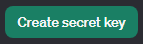
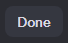

<h1>
  Schizo-Chat
</h1>
<h2>
  Setting up the Project File
</h2>
<h3>
  Downloading the Project File
</h3>
<li>
  Clone this repository (or <a href="https://github.com/guacboy/fake_chatters/archive/refs/heads/main.zip">download</a> a ZIP archive)
</li>
<ul>
  <ul>
    <li>
      <code>git clone https://github.com/guacboy/fake_chatters</code>
    </li>
  </ul>
</ul>
<li>
  Install the <code>requirements.txt</code> dependencies
</li>
<ul>
  <ul>
    <li>
      <code>python -m pip install -r requirements.txt</code>
    </li>
  </ul>
</ul>
<h3>
  Creating an OpenAI API key
</h3>
<li>
  Open <a href="https://platform.openai.com/api-keys">this</a> website and click  located on the top-right
</li>
<li>
  Feel free to name it whatever, then click  to create your API key
</li>
<ul>
  <ul>
    <li>
      DISCLAIMER: DO NOT SHARE THIS!
    </li>
  </ul>
</ul>
<li>
  Copy your API key and click 
</li>
<ul>
  <ul>
    <li>
      If you ever lose access to your API key, you can click  on the right and follow the steps above to create a new one
    </li>
  </ul>
</ul>
<li>
  Create a <code>.env</code> file
</li>
<ul>
  <ul>
    <li>
      <code>touch .env</code>
    </li>
  </ul>
</ul>
<li>
  Paste the following below into the <code>.env</code> file (make sure to change <code>YOUR_OPENAI_API_KEY</code> to the API key you created above)
</li>
<ul>
  <ul>
    <li>
      <code>OPENAI_API_KEY=YOUR_OPENAI_API_KEY</code>
    </li>
  </ul>
</ul>
<h3>
  Opening the Project File
</h3>
<li>
  Open the <code>fake_chatters</code> folder (inside a terminal/code editor)
</li>
<li>
  Navigate to the <code>fake_chatters > src</code> folder
</li>
<ul>
  <ul>
    <li>
      <code>cd src</code>
    </li>
  </ul>
</ul>
<li>
  Run the <code>main.py</code> file
</li>
<ul>
  <ul>
    <li>
      <code>python main.py</code>
    </li>
  </ul>
</ul>
 
and voilà! Project should now open.
<h2>
  License and Source
</h2>
This project is distributed under the terms of the MIT license, as described in the <a href="https://github.com/guacboy/fake_chatters/blob/main/LICENSE">LICENSE.md</a> file. The data collected for this project is available in the link(s) provided below:
<li>
  https://www.youtube.com/playlist?list=PL3loRFGguUrMsi9QKbKSP9cJ2k2ufopuS <i>(Jerma985's Chat)</i>
</li>
